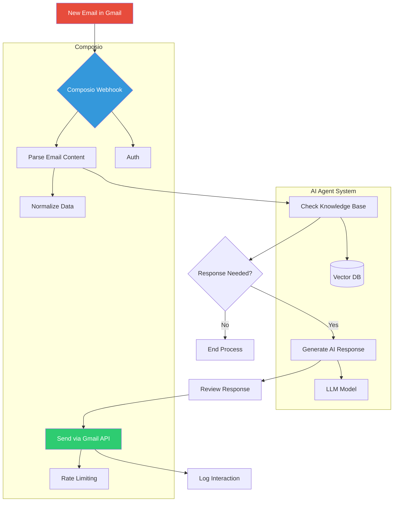

## CycleSyncAi Mail AI Agent

```mermaid
flowchart TD
    A[New Email in Gmail] --> B{Composio Webhook}
    B --> C[Parse Email Content]
    C --> D[Check Knowledge Base]
    D --> E{Response Needed?}
    E -- Yes --> F[Generate AI Response]
    E -- No --> G[End Process]
    F --> H[Review Response]
    H --> I[Send via Gmail API]
    I --> J[Log Interaction]
    
    subgraph AI Agent System
        D --> K[(Vector DB)]
        F --> L[LLM Model]
    end
    
    subgraph Composio
        B --> M[Auth]
        C --> N[Normalize Data]
        I --> O[Rate Limiting]
    end
    
    style A fill:#e74c3c,color:white
    style B fill:#3498db,color:white
    style I fill:#2ecc71,color:white
```
